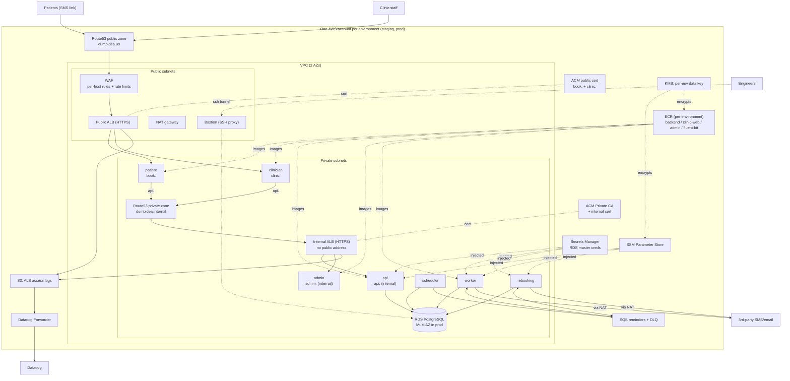

# Acme Corp — Infrastructure Architecture

Get Acme off the hand-built VM and onto reproducible, right-sized infrastructure that a
4-engineer team can operate, that takes the sensitivity of patient data seriously, and that
has room to 3x in a year without a rewrite.

The guiding principle throughout: **choose the most boring, managed option that solves the
problem, and defer everything that isn't load-bearing yet.** A seed-stage team's scarcest
resource is engineering attention, not compute.

Two things are exempt from that deferral instinct, in this order:

1. **Security.** Acme stores health-adjacent data and sells to clinics on trust. Controls are
   built in, not bolted on later. Where one is deferred, EVOLUTION.md names the trigger.
2. **Monitoring.** Infrastructure nobody can observe is infrastructure nobody can operate,
   and Acme's most damaging failure mode (reminders silently not going out) produces no
   user-facing error at all. Every component ships with the monitor that catches its
   characteristic failure.

## Diagram



## Shape of the system

- **Three containers on ECS Fargate**: `api` (REST backend), `web` (clinic-staff app +
  patient booking pages), `worker` (reminder dispatch). One reusable `ecs-service` module.
- **Seven services on ECS Fargate.** Four take HTTP traffic: `patient` (`book.dumbidea.us`),
  `clinician` (`clinic.dumbidea.us`), `api` (`api.dumbidea.internal`), and `admin`
  (`admin.dumbidea.internal`). Three have no inbound path: `worker`, `scheduler`, and
  `rebooking`. Several share an image and differ only by their command.
- **Two load balancers, split by exposure.** An internet-facing ALB carries the two public
  sites and is the only resource in the design with a public address. An internal ALB carries
  `api.` and `admin.` in the private subnets, with a security group that admits the VPC range
  only. Nothing outside the VPC can route to it, and the security group says so anyway.
- **Two DNS domains.** `dumbidea.us` is a public Route53 zone. `dumbidea.internal` is a
  private hosted zone associated with the VPC; the association is what makes it resolve, and
  nothing outside an associated VPC can resolve those names at all.
- **Two certificate paths.** A public DNS-validated ACM certificate for the external
  hostnames, and a certificate from our own AWS Private CA for the internal ones, because a
  public CA cannot validate a domain that does not exist publicly.
- **WAF** on the internet-facing ALB only, with managed rule groups and rate limits tuned per
  hostname. Both ALBs write **access logs** to one S3 bucket under separate prefixes,
  forwarded on to Datadog.
- **RDS PostgreSQL** in private subnets, encrypted, credentials managed by RDS in Secrets
  Manager. Single instance in staging; Multi-AZ in prod.
- **Two SQS queues, each with a DLQ**: `reminders` and `rebooking`. Both decouple sends from
  the third-party provider so a flaky external API produces retries and a dead-letter trail
  rather than lost messages. They are separate so a rebooking backlog cannot stall
  time-sensitive appointment reminders behind it, and so they can carry different staleness
  thresholds: 15 minutes for reminders, an hour for rebooking offers.
- **Per-environment ECR** with immutable tags and scan on push, holding the three service
  images plus our own Fluent Bit log router.
- **Datadog** for metrics, logs, and (in prod) APM, with patient data scrubbed inside the
  task before anything leaves the VPC.
- **A small bastion** giving engineers an SSH tunnel to the database, which lives in a
  private subnet. Key-only, CIDR-restricted, keys listed in `env.hcl`.

## Configuration layering

Every environment-specific value lives in one of four layers, and unit files contain none of
them. This is not a style preference: the promotion pipeline copies `terragrunt.hcl` verbatim
between environments, so an account ID or instance size written into a unit would be silently
carried into prod and be wrong there.

| Layer | Holds |
|---|---|
| `config.hcl` | AWS accounts, project name, state backend, KMS alias derivation |
| `envs/<env>/env.hcl` | environment identity, sizing, paging targets, feature toggles |
| `envs/<env>/<region>/region.hcl` | AZs, VPC and subnet CIDRs, hostnames, hosted zone |
| `<unit>/app_config.hcl` | values only that component cares about: ports, priorities, queue tuning |

The invariant is mechanically checkable, and checked:

```bash
diff -r envs/staging/us-west-2 envs/prod/us-west-2 -x region.hcl   # empty
```

Units get their values through an exposed include, so there is one way to do it:

```hcl
include "root" { path = find_in_parent_folders("root.hcl"), expose = true }
locals {
  env    = include.root.locals.env
  region = include.root.locals.region
  app    = read_terragrunt_config("${get_terragrunt_dir()}/app_config.hcl").locals
}
```

## Key decisions and trade-offs

**Compute: ECS Fargate, not Kubernetes.** One containerized service and four engineers do
not justify an EKS control plane, node lifecycle, and the platform tooling (ingress
controllers, cert automation, GitOps) that make Kubernetes usable. Fargate gives containers,
rolling deploys, autoscaling, and per-service IAM with almost no operational surface.
*Trade-off:* less bin-packing efficiency and higher per-task cost at large scale — a good
problem to have later, and an explicit EVOLUTION trigger.

**Database: RDS PostgreSQL, not Aurora.** RDS Postgres is the boring, well-understood
managed option; it does Multi-AZ, automated backups, encryption, and storage autoscaling.
Aurora is defensible but adds cost and concepts (reader endpoints, ACUs) Acme doesn't need at
40k bookings/month. *Trade-off:* RDS scales vertically and fails over more slowly than
Aurora; revisit when read load or failover time actually hurts.

**Async: two SQS queues, not an event bus.** The async need is "contact someone, reliably,
against a third party that will occasionally fail," and it comes in two flavours with
different urgency: appointment reminders and no-show rebooking offers. That is two queues,
each with a DLQ, written by the scheduler and drained by their own consumer. *Trade-off:* if
the workflow grows fan-out (SMS vs email vs voice, retry tiers), this is the first thing to
expand, and a third queue is cheap. An event bus would be speculative today.

**Edge: ALB, not API Gateway/CloudFront.** An ALB with ACM and host-based routing covers
HTTPS, health checks, and multiple hostnames. *Trade-off:* no CDN, so static assets are served
from the web tasks. Fine at this size.

**Certificates: public ACM outside, a private CA inside.** The external hostnames get a free
DNS-validated ACM certificate. The internal ones cannot: `dumbidea.internal` does not exist on
the public internet, so no public CA can validate it, which leaves running our own. AWS Private
CA does that and ACM renews the leaf automatically.

*Trade-off, and it is a big one:* **AWS Private CA bills per CA per month whether it issues
anything or not** — roughly $400 in general-purpose mode, roughly $50 in short-lived-certificate
mode, times two environments. That is by far the largest line item in this design, in a company
that declined VPC flow logs on cost. Prod runs general-purpose; staging runs short-lived, which
also means any trouble with weekly rotation surfaces in staging first. The cheaper alternative,
if the cost stops being worth it, is to name the internal domain `internal.dumbidea.us` instead:
a public ACM certificate covers it for free, while a private hosted zone shadowing that name
keeps resolution inside the VPC. That gives up having our own CA in the directory, which is the
thing being bought here.

**WAF: one Web ACL on the public ALB only.** The internal ALB has no public address, so there
is nothing for a WAF to filter there and no reason to pay for one. On the public side, WAF
associates one Web ACL with one load balancer, not one per hostname, so per-hostname tuning
happens inside a single ACL using scope-down statements on the Host header. Each hostname gets
its own managed rule groups and rate limits and can be moved from count to block independently. *Trade-off:* every rule ships in
**count mode**. Turning managed rule sets straight to block against a live booking flow is how
you take the site down with no deploy to blame, so there is a week of watching before each
hostname flips.

**Registry: one ECR per environment, not a shared one.** The tempting alternative is a single
registry that both environments pull from, so prod runs the exact bytes staging tested. We
went the other way: images are copied between environment registries with `skopeo`, which
preserves the digest, so the "same bytes" property holds anyway, and no environment ever
reads from another environment's account. *Trade-off:* two registries to keep tidy and a copy
step in the pipeline. The end state is a dedicated `acme-tools` account holding images for
every environment, which is an EVOLUTION step tied to the Organizations split.

**Secrets: split across two stores, deliberately.** Application secrets (third-party provider
keys, the Datadog API key) live in **SSM Parameter Store** as SecureStrings under a
per-environment KMS key, with values supplied from SOPS-encrypted files out of band. The
**database master credentials live in Secrets Manager**, RDS-managed, and appear in no file
at all. Keeping the two credential classes in different systems means the blast radius of a
leaked SOPS file or a compromised CI runner stops short of the database, and the master
password keeps native rotation, which a hand-managed secret would not. *Trade-off:* two
mechanisms for engineers to learn instead of one. Worth it for the separation.

**Environments: staging + prod, one AWS account each.** Acme has *no* staging today, which is
the biggest single risk in "deploys by SSH." Standing up an identical staging is high-value
and cheap. Each environment gets its own account, so `allowed_account_ids` on the generated
provider is a real guard rather than decoration, and a mistaken `apply` cannot reach the other
environment at all.

**Terraform state lives in the environment it describes**, one bucket and one lock table per
account. The tempting alternative is a shared tools account holding both, since state feels
like tooling. It is not: state is the artifact that lets you destroy an environment, it is
read and written only by that environment's pipeline, and centralising it would mean anyone
with tools-account access could corrupt prod's state, undoing the account boundary that is the
whole point. Shared *infrastructure* — registries, Atlantis, dashboards — is a good fit for a
tools account, and that is exactly what EVOLUTION.md proposes for it. *Trade-off:* two buckets
and two bootstrap runs instead of one, and no single place to audit state access.

**IaC: Terragrunt over plain Terraform.** The modules are ordinary Terraform; Terragrunt
keeps backend and provider config DRY and lets staging and prod share byte-identical unit
definitions. *Trade-off:* one more tool; mitigated because the modules are portable Terraform
if the team ever drops the wrapper.

## Security posture (health-adjacent data)

- **Network isolation:** app tasks and the database live in **private subnets**; only the ALB
  is internet-facing. Egress to the provider goes through a NAT gateway.
- **Least-privilege security groups:** the ALB SG is the only source allowed to the task
  port; each service has its own SG. The bastion's egress is narrowed to HTTPS and Postgres.
- **Exposure split at the load balancer:** only `book.` and `clinic.` are reachable from the
  internet. `api.` and `admin.` are on an internal ALB with no public address, on names that
  resolve only inside the VPC. The admin surface in particular is not on the internet at all.
- **Edge filtering:** WAF on the public ALB with AWS managed rule groups and two tiers of rate
  limiting. A blanket per-IP limit sized so a whole clinic office or a mobile carrier NAT does
  not trip it, plus a much tighter limit scoped to the authentication paths on `clinic.` —
  because 1,500 requests per five minutes is still 1,500 password guesses, and the blanket
  limit alone is not an anti-credential-stuffing control.
- **Audit trail:** ALB access logs to a versioned, TLS-only S3 bucket with a defined retention,
  forwarded to Datadog for search. WAF decisions are logged with the authorization header,
  cookies, and query string redacted.
- **Human access:** the bastion accepts keys only, never passwords, with the hardening applied
  as an sshd drop-in that sorts ahead of the cloud-init defaults (editing `sshd_config`
  directly looks correct and is silently overridden on Amazon Linux 2023). IMDSv2 is required,
  the root volume is encrypted, and every authorized key is listed in `env.hcl` where adding
  or removing one is a reviewable diff.
- **Encryption everywhere:** RDS storage, SQS, S3 state bucket, ECR layers, and SSM
  SecureStrings, with a **KMS key per environment** so staging keys cannot decrypt prod data.
  TLS 1.3 policy at the ALB.
- **Secrets discipline:** Terraform creates parameter and secret *containers* and never sees
  a value. SOPS-encrypted files carry the values; `.gitignore` denies anything in a secrets
  directory that is not `*.enc.*`, and a pre-commit hook opens each such file and refuses the
  commit if it is not genuinely encrypted, because the filename alone is not a control.
- **Per-service IAM:** distinct task and execution roles; the worker's SQS access is scoped to
  its one queue; each execution role reads only the parameters its own task injects.
- **Supply chain:** ECR tags are immutable, so a deployed tag can never be repointed at
  different bytes, and every push is scanned.
- **Monitoring vendor access is read-only:** the role Datadog assumes can read CloudWatch and
  resource metadata and change nothing, and requires the external ID Datadog issues.
- **State safety:** remote state in a private, versioned, encrypted S3 bucket with DynamoDB
  locking.

Known and deliberate gaps, with triggers in EVOLUTION.md:

- **The clinic staff app is single-factor.** `app.` is a public URL where staff log in to read
  patient data, and a password is the only control. TOTP is the highest-priority item in
  EVOLUTION.md and is application work, not infrastructure. The WAF rate limits slow an
  attack; they do not fix this.
- **The database security group admits the whole VPC CIDR** rather than being SG-to-SG. A
  conscious call: nothing else runs in this VPC and everything in it legitimately needs the
  database.
- **The bastion is an interactive shell reachable from the internet**, restricted by CIDR and
  key list. Tailscale or a VPN is the better answer.
- **The application uses the RDS master credential**, and **GuardDuty and a CloudTrail org
  trail are not on**.
- **VPC flow logs are declined**, not deferred: excessive at this size, and the ALB access logs
  cover the traffic that actually matters.

## Monitoring and alerting

Monitoring ranks second only to security here, and is built in three layers so the first one
delivers value on day one.

**Layer 1 — AWS integration, no agent.** A read-only IAM role Datadog assumes
(`modules/datadog-aws-integration`) yields RDS, ALB, SQS, and ECS metrics without touching
the application. Nearly every alert worth having comes from this layer.

**Layer 2 — logs through a scrubbing router.** Each task runs a Fluent Bit sidecar built from
`modules/ecs-service/fluent-bit/`, which ships logs straight to Datadog and skips CloudWatch
ingestion cost and lag. ALB access logs take a different path, because an ALB can only write
to S3: they land in a retention-managed bucket and a Datadog Forwarder Lambda ships each new
file on. S3 stays the durable audit trail, Datadog is the search interface, and the audit
trail outlives the monitoring vendor contract.

**Layer 3 — the agent sidecar.** Fargate has no host, so the Datadog agent runs as a
container in each task, providing DogStatsD and APM. Enabled in prod, off in staging until
the application is instrumented.

### Patient data never leaves the VPC

This is the constraint that shapes the whole monitoring design. Scrubbing happens **inside
the task, before egress**, not server-side after the fact:

- **Logs:** Fluent Bit drops any record the app flagged `contains_phi`, redacts email, phone,
  SSN- and card-shaped strings at any nesting depth, blanks known patient field names, and
  strips `authorization`, `cookie`, and `x-api-key`. The filters and a test recipe are in
  [`modules/ecs-service/fluent-bit/README.md`](modules/ecs-service/fluent-bit/README.md).
- **APM:** the agent rewrites span tags via `DD_APM_REPLACE_TAGS` and strips query strings and
  numeric path segments so patient identifiers never become span resources.

Both are backstops. The application should not be emitting patient data in the first place,
and a redaction firing in production is a bug to fix upstream. Datadog will also need to be
covered by a BAA before production traffic; that is an EVOLUTION item.

### What pages, and what doesn't

Four engineers cannot carry twenty pagers, so the monitor set is short and the paging set is
shorter. Alerts nobody acts on teach people to ignore the ones that matter.

| Pages | Notifies Slack |
|---|---|
| Either DLQ is non-empty (reminders, rebooking) | API p95 latency degraded |
| Either queue's oldest message is stale | Database CPU high |
| API 5xx rate above threshold | Database connections climbing |
| ALB has no healthy targets | |
| Database free storage low | |
| Reminder worker has zero running tasks | |
| Internal ALB has no healthy targets | |

The worker monitor exists because the worker has no inbound traffic: when it dies, no user
request fails to tell you about it. That is exactly the failure that costs Acme customers.

One SLO, not a wall of them: booking API availability at 99.9% over 30 days, which turns
health into an error budget the team can spend.

**Staging never pages.** It sits under a permanent Datadog downtime, so every monitor still
evaluates and records history — which is what makes them trustworthy by the time they matter
in prod — while being structurally incapable of waking anyone. Without this, the usual outcome
is somebody muting staging by deleting its monitors.

## What I deliberately left out or kept simple

Scoring rewards restraint, so these are choices, not omissions:

- **No Kubernetes, service mesh, or GitOps** — no second service to orchestrate yet.
- **No AWS Organization, SCPs, or Identity Center** — the accounts are separate, but they are
  standalone accounts with profiles, not an Org with guardrails. That is the next structural
  step, along with a shared tools account.
- **No CI/CD pipeline built** — described below; wiring GitHub Actions is a day-one follow but
  not infrastructure design.
- **No CDN, GuardDuty, or CloudTrail org trail yet** — fast-follows tied to real triggers.
- **VPC flow logs declined outright** — see EVOLUTION.md for what would change that.
- **No MFA on the clinic staff app** — the single largest risk in the whole design, and
  deliberately out of scope here because it is application work.
- **No read replica, connection pooler, or caching layer** — no evidence of the load that
  justifies them.
- **Worker is a single service, not a scheduler + fan-out** — matches the one job it has.
- **APM off in staging** — the agent is there, tracing is not, until the app is instrumented.

## How the 4 engineers deploy

**Application deploys** (frequent — the thing that replaces SSH). CI builds the service
image, tags it immutably with the commit SHA, pushes it to the environment's ECR, registers a
new task definition revision pointing at that tag, and calls `aws ecs update-service`. ECS
does a rolling replacement behind the ALB, draining old tasks as new ones pass health checks.
Promotion to prod is a `skopeo copy` of the tested image into the prod registry followed by
the same update against prod.

Note that `--force-new-deployment` on its own only helps if the tag is mutable; with
immutable tags the pipeline must register a new revision. That is the safer shape anyway.

The `ecs-service` module sets `ignore_changes = [task_definition, desired_count]` precisely so
**CI owns the running image and Terraform owns the infrastructure** — the two don't fight.
Rollback is redeploying the previous tag.

**Infrastructure changes** (rare). Edit a module or a unit, open a PR, review the
`terragrunt plan`, merge, apply to staging, then prod. Because unit files are byte-identical
across environments, a change is made once and promoted by applying it in the other
environment.

**Secrets.** Edit `envs/<env>/secrets/app-secrets.enc.yaml` with `sops`, commit the encrypted
file, then `./scripts/secrets-push.sh <env>` to write the values into SSM. Terraform is not
involved and never sees a value. Redeploy the services that consume a changed parameter, since
ECS resolves secrets at task start.

**First-run order**, per environment. `envs/bootstrap/<env>` (state bucket + lock table, local
backend, applied once per account)
→ `security/kms` → `registry/ecr` → `observability/datadog-forwarder` → `network/vpc` →
`security/bastion` → `edge/acm-public` + `edge/acm-private` + `edge/alb-logs` →
`edge/alb-public` + `edge/alb-internal` → `edge/waf` → `data/*` → push secrets →
build and push images → `compute/ecs/*` → `edge/dns-public` + `edge/dns-private` →
`observability/{datadog-integration,monitors}`.

After `edge/acm-private` applies the first time, export the root certificate so it can be
distributed to clients:

```bash
terragrunt --working-dir envs/prod/us-west-2/edge/acm-private \
  output -raw ca_certificate_pem > acme-internal-root-ca.pem
```

Terragrunt resolves most of this from the `dependency` blocks. Three steps are manual and must
precede the first service apply: pushing secrets, building and pushing the service images, and
building the Fluent Bit log router image. Datadog's own AWS integration also needs to be
created in their UI once, to obtain the external ID that goes into `env.hcl`.
